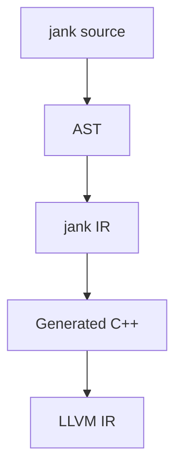

# IR reference
jank has its own custom
[SSA-based](https://en.wikipedia.org/wiki/Static_single-assignment_form) intermediate
representation (IR), which it uses for all compiled jank code. Even though jank
is tightly coupled with Clang/LLVM, using LLVM IR directly rules out large
classes of optimizations, since LLVM IR is significantly lower level than the
semantics of Clojure. However, jank's IR is exactly at the level of Clojure's
semantics, which allows us to optimize things like var derefs, persistent data
structures, transients, closure captures, and so on.

## Compilation model
Every compiled function gets turned into jank IR after it's analyzed into the
jank abstract syntax tree (AST). From there, we optimize the IR and then finally
generate C++ code from the IR, which we give to Clang to compile into LLVM IR.



## Overview
jank's IR is represented as an IR module, at the highest level. IR modules
contain the following:

* Module name
* Lifted vars
* Lifted constants
* Functions

IR modules are stored in memory as C++ objects, but they can be rendered to
Clojure data for easy debugging or for writing tests. Round trip serialization
is not supported, since there's more information that we store than we can
reasonably render to Clojure data, including some Clang AST internals needed for
C++ interop. As an example of some jank IR, here's a simple jank function
and its corresponding IR.

```clojure
(defn greet
  [name]
  (if (= "jeaye" name)
    (println "Are you me?!")
    (println (str "Hello, " name "!"))))
```

We can get the IR printed for each compiled function by setting
`JANK_PRINT_IR=1` when we invoke jank.

```clojure
{:name user_greet_82687
 :lifted-vars {clojure_core_SLASH_str_82694 clojure.core/str
               clojure_core_SLASH_println_82691 clojure.core/println
               clojure_core_SLASH__EQ__82689 clojure.core/=}
 :lifted-constants {const_82693 "!"
                    const_82692 "Hello, "
                    const_82690 "Are you me?!"
                    const_82688 "jeaye"}
 :functions [{:name user_greet_82687_1
              :blocks [{:name entry
                        :instructions [{:name greet :op :parameter :type "jank::runtime::object_ref"}
                                       {:name name :op :parameter :type "jank::runtime::object_ref"}
                                       {:name v3 :op :literal :value "jeaye" :type "jank::runtime::obj::persistent_string_ref"}
                                       {:name v4 :op :var-deref :var clojure_core_SLASH__EQ__82689 :type "jank::runtime::object_ref"}
                                       {:name v5 :op :dynamic-call :fn v4 :args [v3 name] :type "jank::runtime::object_ref"}
                                       {:name v7 :op :truthy :value v5 :type "bool"}
                                       {:name v8 :op :branch :condition v7 :then if0 :else else1 :merge nil :shadow nil :type "void"}]}
                       {:name if0
                        :instructions [{:name v9 :op :literal :value "Are you me?!" :type "jank::runtime::obj::persistent_string_ref"}
                                       {:name v10 :op :var-deref :var clojure_core_SLASH_println_82691 :type "jank::runtime::object_ref"}
                                       {:name v11 :op :dynamic-call :fn v10 :args [v9] :type "jank::runtime::object_ref"}
                                       {:name v12 :op :ret :value v11 :type "jank::runtime::object_ref"}]}
                       {:name else1
                        :instructions [{:name v13 :op :literal :value "Hello, " :type "jank::runtime::obj::persistent_string_ref"}
                                       {:name v14 :op :literal :value "!" :type "jank::runtime::obj::persistent_string_ref"}
                                       {:name v15 :op :var-deref :var clojure_core_SLASH_str_82694 :type "jank::runtime::object_ref"}
                                       {:name v16 :op :dynamic-call :fn v15 :args [v13 name v14] :type "jank::runtime::object_ref"}
                                       {:name v17 :op :var-deref :var clojure_core_SLASH_println_82691 :type "jank::runtime::object_ref"}
                                       {:name v18 :op :dynamic-call :fn v17 :args [v16] :type "jank::runtime::object_ref"}
                                       {:name v19 :op :ret :value v18 :type "jank::runtime::object_ref"}]}]}]}
```

Modules have at least one function, where each function corresponds with a
single arity of a jank function. IR functions are broken into basic blocks,
which are a common fundamental principle in control flow graphs (CFGs). Each
basic block has exactly one terminator, which must be the last instruction in
the block. We start at the first block, which is generally called `entry`.

The remainder of this document will describe each IR instruction.

## Data structures
### `literal`
The `literal` instruction introduces a lifted constant into the scope. This
instruction is only used for boxed jank values, not unboxed C++ literals.

```clojure
{:name v8 :op :literal :value 1 :type "jank::runtime::obj::integer_ref"}
```

### `persistent-list`
The `persistent-list` instruction creates a list object, given the values
provided. This is generally only used for packing arguments to variadic
functions, since otherwise a list would just be a literal.

```clojure
{:name v12 :op :persistent-list :values [v10 v11] :type "jank::runtime::obj::persistent_list_ref"}
```

### `persistent-vector`
The `persistent-vector` instruction creates a vector object, given the values
provided. This is only used for vectors which aren't literals.

```clojure
{:name v3 :op :persistent-vector :values [v0 v1 v2] :type "jank::runtime::obj::persistent_vector_ref"}
```

### `persistent-array-map`
The `persistent-array-map` instruction creates an array map object, given the values
provided. This is only used for maps which aren't literals and only if they're
small enough to fit in an array map. Otherwise, a hash map is used.

```clojure
{:name v4 :op :persistent-array-map :values [[v1 v0] [v2 v3]] :type "jank::runtime::obj::persistent_array_map_ref"}
```

### `persistent-hash-map`
The `persistent-hash-map` instruction creates a hash map object, given the values
provided. This is only used for maps which aren't literals and only if they're
too large to fit in an array map.

```clojure
{:name v4 :op :persistent-hash-map :values [[v1 v0] [v2 v3]] :type "jank::runtime::obj::persistent_hash_map_ref"}
```

### `persistent-hash-set`
The `persistent-hash-set` instruction creates a hash set object, given the values
provided. This is only used for maps which aren't literals.

```clojure
{:name v3 :op :persistent-hash-set :values [v0 v1 v2] :type "jank::runtime::obj::persistent_hash_set_ref"}
```

## Functions
### `function`
The `function` instruction creates a new function object, given all of its
arities and the arity flags. Each arity is its own C function. Note that
function objects don't support captured values. For those, we use `closure`.

```clojure
{:name v0 :op :function :arities {0 user_foo_82687_0} :arity-flags 0 :type "jank::runtime::obj::jit_function_ref"}
```

### `closure`
The `closure` instruction creates a new closure object, given all of its
arities, arity flags, and captures. Each arity is its own C function. Note that
closure objects are used when we have captures. If there are no captures, we use
a `function`. The context of a closure is the name of the struct which is
created just for this closure, to hold its captures.

```clojure
{:name v1 :op :closure :context user_foo_82688_ctx :arities {0 user_foo_82688_0} :captures {a {:name v0 :type jank::runtime::object_ref}} :arity-flags 0 :type "jank::runtime::obj::jit_closure_ref"}
```

### `parameter`
The `parameter` instruction introduces a named parameter of the function into
the local scope. jank will automatically generate one of these for each
parameter a function has. Unlike most instructions, the name used for this
instruction is not auto-generated. The munged name of the actual parameter is
used. Parameters will always have the type `object_ref`.

```clojure
{:name n :op :parameter :type "jank::runtime::object_ref"}
```

### `capture`
The `capture` instruction is similar to the `parameter` instruction, in that it
introduces a named closure capture into the scope. jank will automatically
generate one of these for each capture a function has. Like `parameter`, the
munged name of the actual capture is used for the instruction name. Captures may
have the type `object_ref` or any other type.

```clojure
{:name n :op :capture :type "jank::runtime::object_ref"}
```

### `dynamic-call`
The `dynamic-call` instruction will invoke the `call` behavior on the provided
`:fn`. This works for any jank runtime object which implements the `call`
behavior, such as functions, closures, keywords, maps, and so on. Any number of
arguments can be provided and the runtime will handle packing them as necessary.

```clojure
{:name v2 :op :dynamic-call :fn v1 :args [v0] :type "jank::runtime::object_ref"}
```

### `named-recursion`
The `named-recursion` instruction will recur into the current function, without
performing argument packing. This recursion doesn't need to be in tail position,
unlike normal `recur` usage. It's separated from `dynamic-call` as an
optimization.

```clojure
{:name v1 :op :named-recursion :fn foo :args [v0] :type "jank::runtime::object_ref"}
```

### `recursion-reference`
The `recursion-reference` instruction will store a reference to the current
function. This is only used when capturing or returning the function object.
When the recursion reference is called, a `named-recursion` instruction is used
instead.

Note that recursion references that cross function boundaries are represented as
a `capture` instruction instead. So a `recursion-reference` is only ever used
for the immediate function.

```clojure
{:name v0 :op :recursion-reference :type "jank::runtime::object_ref"}
```

## Vars
### `def`
The `def` instruction interns a var, sets is root, and updates its metadata. The
name of this instruction will refer to the var itself. Note the the `:value` is
optional. If there is no value present, the var will still be interned and have
its metadata updated, but its root will not be updated.

```clojure
{:name v2 :op :def :var user/foo :value v0 :meta v1 :type "jank::runtime::obj::var_ref"}
```

### `var-deref`
The `var-deref` instruction grabs the latest value out of an interned var. This
is implicitly done, via Clojure's semantics, whenever a var is referenced by
its name. For example, `(println :meow)` implicitly derefs
`clojure.core/println`.

```clojure
{:name v1 :op :var-deref :var clojure_core_SLASH_println_82689 :type "jank::runtime::object_ref"}
```

### `var-ref`
The `var-ref` instruction grabs an interned var directly, without dereferencing
it. This is analogous to the `#'foo` syntax, in Clojure.

```clojure
{:name v1 :op :var-ref :var clojure_core_SLASH_println_82689 :type "jank::runtime::obj::var_ref"}
```

### `type-erase`
The `type-erase` instruction will strip typed object information away from boxed
jank runtime objects. This is used specifically for mutable values, such as loop
bindings, since they may be initialized with an empty vector, but we have no
idea what type of value each iteration will bring, so we need to represent the
value as a type-erased `object_ref` instead. This instruction is only meant to
be used on boxed jank objects.

```clojure
{:name v1 :op :type-erase :value v0 :type "jank::runtime::object_ref"}
```

## Control flow
### `jump`
The `jump` instruction is a terminator which will unconditionally jump to a
different IR block. The instruction also knows whether it's part of a loop, in
which case it's effectively a `continue;`.

```clojure
{:name v9 :op :jump :block if-merge3 :loop false :type "void"}
```

### `branch-set`
The `branch-set` instruction is half of the `branch-set`/`branch-get` pair,
which is used to store the expression result of branching so that the merge
block can have a value to use. In other IRs, `branch-get` is called `phi`.
jank's IR usage of `branch-set`/`branch-get` is based on the Pizlo-style
upsilon/phi, just without the Greek naming.

Each `branch-set` will refer to a "shadow" name, without assigning it into the
SSA semantics. The shadow gets assigned into a proper instruction name when
`branch-get` is used.

The name of the `branch-set` instruction is never used and the type is always
`void`.

```clojure
{:name v11 :op :branch-set :shadow s4 :value v10 :type "void"}
```

### `branch-get`
The `branch-get` instruction is half of the `branch-set`/`branch-get` pair,
which is used to store the expression result of branching so that the merge
block can have a value to use. See the `branch-set` docs for more info.

The name of the `branch-get` is always the same as the shadow variable used in
the `branch-set`. The type is the actual type of the shadow variable, which
could be any jank object or native type.

```clojure
{:name s4 :op :branch-get :type "jank::runtime::obj::keyword_ref"}
```

### `branch`
The `branch` instruction is a terminator which conditionally jumps to either the
`:then` or `:else` block, depending on whether the `:condition` value is true.
The `branch` instruction also tracks the resulting merge block, if there is one,
and the shadow variable used.

The name of this instruction is never used and its type is always `void`.

```clojure
{:name v6 :op :branch :condition v5 :then if1 :else else2 :merge if-merge3 :shadow s4 :type "void"}
```

### `loop`
The `loop` instruction is a terminator which sets up mutable bindings and then
jumps to the provided merge block. Each mutable binding gets a shadow variable
and the result of the loop also has one.

The name of this instruction is never used and its type is always `void`.

```clojure
{:name v6 :op :loop :loop-block loop4 :merge loop-merge5 :shadow s2 :shadows {{:name s3 :value v1 :type "jank::runtime::object_ref"}} :type "void"}
```

### `case`
The `case` instruction is a terminator which branches to one of the
corresponding case blocks, depending on the provided value. The shift and mask
are set up by the `clojure.core/case` macro and each case block disambiguates
hash collisions. This instruction also tracks whether there's a merge block and
shadow variable.

The name of this instruction is never used and its type is always `void`.

```clojure
{:name v54 :op :case :shift 0 :mask 0 :value v3 :case-blocks [{:value 3 :block case36} {:value 2 :block case21} {:value 1 :block case6}] :default-block default51 :merge-block nil :shadow nil :type "void"}
```

### `ret`
The `ret` instruction is a block terminator which returns a value from the
current function. It has a name, like all instructions, but that name will never
be used. The type of a `ret` instruction is the type of the returned data.

```clojure
{:name v7 :op :ret :value v4 :type "jank::runtime::object_ref"}
```

## Exceptions
### `try`
The `try` instruction is a starter which denotes that the rest of the basic
block will be part of a `try` body. This instruction notes the various catch
types and their corresponding blocks, as well as whether there is a finally
block. A `try` instruction will always have a merge block and a shadow variable
for its result.

The name of this instruction is never used and its type is always `void`.

```clojure
{:name v11 :op :try :catches [{:type "jank::runtime::oref<jank::runtime::object> &" :block catch4}] :merge try-merge2 :shadow s3 :finally nil :type "void"}
```

### `catch`
The `catch` instruction is a starter which denotes that the rest of the basic
block will be part of a `catch` body. This instruction also knows the merge
block of the corresponding `try`, as well as the shadow of the `try`.

The name of this instruction, and its type, correspond with the caught exception
value.

```clojure
{:name v5 :op :catch :merge try-merge2 :shadow s3 :type "jank::runtime::oref<jank::runtime::object> &"}
```

### `finally`
The `finally` instruction is a starter which denotes that the rest of the basic
block will be part of a `finally` body. This instruction also knows the merge
block of the corresponding `try`.

The name of this instruction is never used and its type is always `void`.

```clojure
{:name v5 :op :finally :merge try-merge2 :type "void"}
```

### `throw`
The `throw` instruction is a terminator which throws an exeption value. Any
value type can be thrown.

The name of this instruction is never used and its type is always `void`.

```clojure
{:name v19 :op :throw :value v18 :type "void"}
```

## Utilities
### `truthy`
The `truthy` instruction will convert a boxed jank object to a `bool`, generally
for branching. This is avoided whenever we already have a bool, such as when
working with native values.

```clojure
{:name v5 :op :truthy :value v0 :type "bool"}
```

### `letfn`
The `letfn` instruction introduces one or more function/closure locals
simultaneously. It's expected that for `N` bindings, there are `N` instructions
which follow the `letfn` instruction, one to create each binding. The name of
this instruction will not be used.

```clojure
{:name v0 :op :letfn :bindings [foo bar] :type "void"}
{:name v1 :op :function :arities {0 user_foo_82687_0} :arity-flags 0 :type "jank::runtime::obj::jit_function_ref"}
{:name v2 :op :function :arities {0 user_bar_82688_0} :arity-flags 0 :type "jank::runtime::obj::jit_function_ref"}
```

Mutual recursion is handled via `:defer` for the capture. For example, if both
`foo` and `bar` functions do nothing but return each other, we would get this
IR. Notice how the `bar` capture's value name is `:defer`.

```clojure
{:name v0 :op :letfn :bindings [foo bar] :type "void"}
{:name v1 :op :closure :context user_foo_82687_ctx :arities {0 user_foo_82687_0} :captures {bar {:name :defer :type jank::runtime::object_ref}} :arity-flags 0 :type "jank::runtime::obj::jit_closure_ref"}
{:name v2 :op :closure :context user_bar_82688_ctx :arities {0 user_bar_82688_0} :captures {foo {:name v1 :type jank::runtime::object_ref}} :arity-flags 0 :type "jank::runtime::obj::jit_closure_ref"}
```

## C++ interop
### `cpp/raw`
The `cpp/raw` instruction introduces some global C++ which needs to be compiled
alongside this module.

This instruction always has the type `void`.

```clojure
{:name v0 :op :cpp/raw :type "void"}
```

### `cpp/value`
The `cpp/value` instruction accesses an arbitrary C++ value. The value could be
a C++ constant, function, variable, or member access.

```clojure
{:name v0 :op :cpp/value :scope "std::basic_string<char>::npos" :type "const std::basic_string<char>::size_type &"}
```

### `cpp/into-object`
The `cpp/into-object` instruction converts a native C++ value into a jank
runtime object using the `jank::runtime::convert` trait.

```clojure
{:name v2 :op :cpp/into-object :value v1 :type "jank::runtime::object_ref"}
```

### `cpp/from-object`
The `cpp/from-object` instruction converts a boxed jank object into a native C++
value using the `jank::runtime::convert` trait.

```clojure
{:name v2 :op :cpp/from-object :value v1 :type "int"}
```

### `cpp/unsafe-cast`
The `cpp/unsafe-cast` instruction performs a C-style cast from one type to
another.

The type of this instruction is the resulting type of the data.

```clojure
{:name v1 :op :cpp/unsafe-cast :value v0 :type "int *"}
```

### `cpp/call`
The `cpp/call` instruction calls a C++ function, pointer to function, or
functor, with the given arguments. The value of this call will render as `nil`
if it's inlined as a C++ symbol.

The type of this instruction is the return type of the function.

```clojure
{:name v1 :op :cpp/call :value nil :args [v0] :type "std::string"}
```

For example, if you have a `cpp/call` for an IR value, it will be set.

```clojure
{:name v1 :op :cpp/call :value v0 :args [] :type "int"}
```

### `cpp/constructor-call`
The `cpp/constructor-call` instruction constructs a stack-allocated C++ value.
This is used for both overloaded constructors and aggregate initialization.

The type of this instruction is the type of the object being constructed.

```clojure
{:name v1 :op :cpp/constructor-call :args [v0] :type "foo"}
```

### `cpp/member-call`
The `cpp/member-call` instruction calls a member function or operator on an invoking object.
This instruction supports direct members as well as base members. Virtual
functions are supported, as well as default arguments.

The type of this instruction is the return type of the function.

```clojure
{:name v1 :op :cpp/member-call :fn "std::function<void ()>::operator()" :args [v0] :type "void"}
```

### `cpp/member-access`
The `cpp/member-access` instruction reaches into a member of the provided C++
object and grabs a reference to it. This instruction supports direct members as
well as base members.

The type of this instruction is the return type of the function.

```clojure
{:name v3 :op :cpp/member-access :value v2 :member "std::pair<long long, long long>::first" :type "long long &"}
```

### `cpp/builtin-operator-call`
The `cpp/builtin-operator-call` instruction performs a C++ operator on primitive
types. Overloaded operators and operators defined for custom types will use
`cpp/call` or `cpp/member-call`, depending on whether the operator is defined
as a member.

The type of this instruction is the return type of the operator.

```clojure
{:name v2 :op :cpp/builtin-operator-call :op "+" :args [v0 v1] :type "jtl::f64"}
```

### `cpp/box`
The `cpp/box` instruction creates an opaque boxed jank object to store a native
pointer as a `void*`. This value can then be retrieved via `cpp/unbox`, but the
type must be provided, so a cast can be performed. The type will be verified at
runtime.

```clojure
{:name v2 :op :cpp/box :value v1 :type "jank::runtime::object_ref"}
```

### `cpp/unbox`
The `cpp/unbox` instruction extracts the `void*` from an opaque boxed jank
object and casts it to the specified type. The type will be verified at runtime.

The type of this instruction is the extracted type of the native pointer.

```clojure
{:name v4 :op :cpp/unbox :value v2 :type "jtl::i64 *"}
```

### `cpp/new`
The `cpp/new` instruction GC allocates a new C++ value. The result will be a
pointer to that value.

The type of this instruction is the extracted type of the native pointer.

```clojure
{:name v2 :op :cpp/new :value v1 :type "int *"}
```

### `cpp/delete`
The `cpp/delete` instruction frees memory allocated via `cpp/new`. This is not
required, since all values allocated via `cpp/new` are tracked by jank's GC.

This instruction always has the type `void`.

```clojure
{:name v3 :op :cpp/delete :value v2 :type "void"}
```

