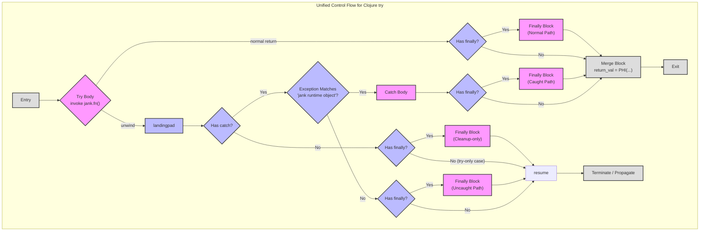

# single try case:

```mermaid
graph TD
    subgraph "Unified Control Flow for Clojure try"
        Entry[Entry] --> TryBody{"Try Body<br>invoke jank.fn()"}

        %% Normal Execution Path
        TryBody -- "normal return" --> HasFinallyNormal{Has finally?}
        HasFinallyNormal -- "Yes" --> FinallyNormal["Finally Block<br>(Normal Path)"]
        FinallyNormal --> Merge
        HasFinallyNormal -- "No" --> Merge["Merge Block<br>return_val = PHI(...)"]

        %% Exception Unwind Path
        TryBody -- "unwind" --> LandingPad["landingpad"]
        LandingPad --> HasCatch{Has catch?}

        %% Branch: No 'catch' clause (covers try-only and try-finally)
        HasCatch -- "No" --> HasFinallyNoCatch{Has finally?}
        HasFinallyNoCatch -- "Yes" --> FinallyCleanup["Finally Block<br>(Cleanup-only)"]
        FinallyCleanup --> Resume["resume"]
        HasFinallyNoCatch -- "No (try-only case)" --> Resume

        %% Branch: Has 'catch' clause (covers try-catch and try-catch-finally)
        HasCatch -- "Yes" --> MatchType{"Exception Matches<br>'jank runtime object'?"}

        %% Sub-branch: Exception type is caught
        MatchType -- "Yes" --> CatchBody["Catch Body"]
        CatchBody --> HasFinallyAfterCatch{Has finally?}
        HasFinallyAfterCatch -- "Yes" --> FinallyCaught["Finally Block<br>(Caught Path)"]
        FinallyCaught --> Merge
        HasFinallyAfterCatch -- "No" --> Merge

        %% Sub-branch: Exception type is NOT caught
        MatchType -- "No" --> HasFinallyUncaught{Has finally?}
        HasFinallyUncaught -- "Yes" --> FinallyUncaught["Finally Block<br>(Uncaught Path)"]
        FinallyUncaught --> Resume
        HasFinallyUncaught -- "No" --> Resume

        %% Final States
        Merge --> Exit[Exit]
        Resume --> Propagate["Terminate / Propagate"]
    end

    %% Styling
    classDef action fill:#f9f,stroke:#333,stroke-width:2px;
    classDef decision fill:#bbf,stroke:#333,stroke-width:2px;
    classDef terminator fill:#ddd,stroke:#333,stroke-width:2px;

    class TryBody,FinallyNormal,CatchBody,FinallyCleanup,FinallyCaught,FinallyUncaught action;
    class HasFinallyNormal,LandingPad,HasCatch,MatchType,HasFinallyNoCatch,HasFinallyAfterCatch,HasFinallyUncaught decision;
    class Entry,Exit,Propagate,Merge terminator;
```

